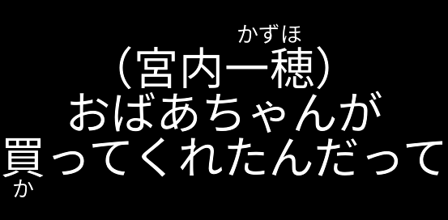
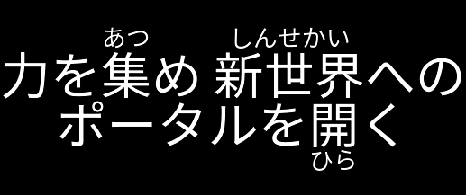

## Progress Report

#### 2020-01-04

Horizontal text rendering is finished.

Input: `（宮内{一穂|かずほ}）\nおばあちゃんが\n{買|か}ってくれたんだって`

Renders into this with the default values:

Input: `力を{集|あつ}め {新世界|しんせかい}への\nポータルを{開|ひら}く` (taken from Netflix Tech Blog)

Renders into this (left alignment):

Input: `{話|・}{せ|・}{る|・}` (Boutens)

Renders into this:

#### 2020-01-04 (late night)

Initial work on vertical text rendering has started.

Input: `ここがウチの村\nのんびりのどかな所です`

Renders into this:

#### 2020-01-05

Vertical furigana implement and general vertical rendering improvements.

Input: `（宮内{一穂|かずほ}）\nおばあちゃんが\n{買|か}ってくれたんだって`

Renders into this:

#### 2020-01-05 (early night)

Rendered the first subtitle today :)

Grep some examples at [jimaku-editor-examples](https://github.com/magiruuvelvet/jimaku-editor-examples)

#### 2020-01-08

Prototype with a command line application is done. While the application
is not very user friendly yet, its possible to produce production-ready
subtitles now.

