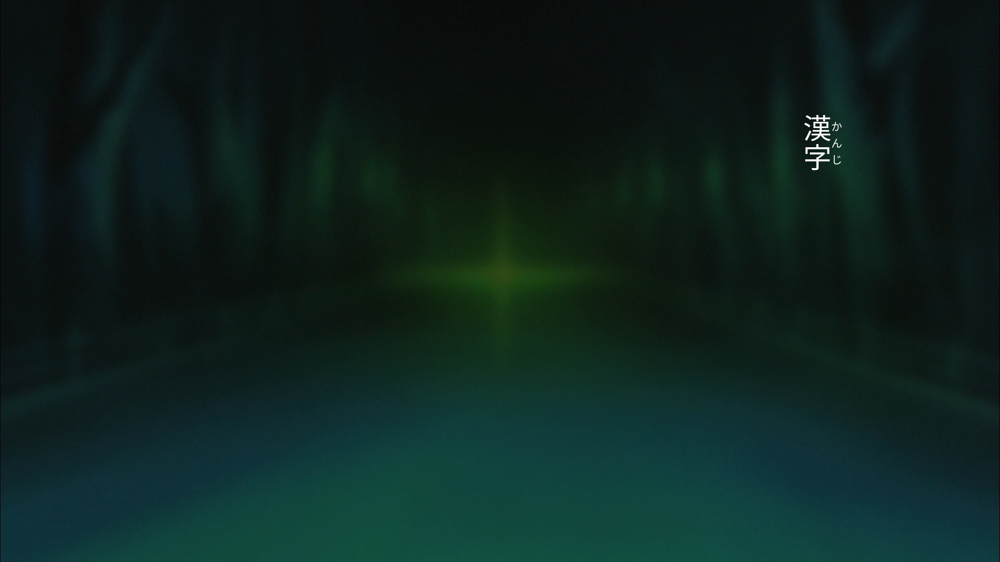

# 字幕エーディタ (Subtitle Editor)

An experimental work-in-progress subtitle editor with
**first class** Japanese language support.

## Planned Features

 - Furigana

 - Vertical writing (top to bottom)

 - Horizontal numbers in vertical text

 - Boutens

 - Rendering the finished subtitle to PGS (Presentation Graphic Stream) to
   overcome the limitations of text-based subtitles when it comes to the
   above features. (SRT/ASS/etc. don't support complex text layouts)

   There is already a working open source PGS encoder I'm planning to use
   for this project. I tested it and it works great and the PGS files are
   compatible with ffmpeg and ffmpeg-based media players :)

   --> [drouarb/PGSEncoder](https://github.com/drouarb/PGSEncoder)

 - Parse SRT files for Japanese subtitles (many of them can be found on the Internet)\
   Many existing subtitles can be made pretty and probably styled that way, without
   starting over from scratch.


## How does it work?

The first stage of the project is to get a command line renderer done.
The idea is to take the text, together with **styling and layout hints**,
as input and the application renders PNG images out of it, which can be
used to feed the PGS encoder to produce the final picture-based subtitle
which looks the same on every device and player.

The hard part will be the rendering of Furigana and vertical text.
For vertical text some font glyphs must be rotated 90 degree clockwise.
If you known Japanese than you know what I'm talking about.

For this I need to create a new subtitle format which can store several
styling and layout hints. To keep it simple I'm just extending the SRT
format with an additional line after the timestamp.

#### Example

```plain
2
00:00:16,599 --> 00:00:18,935 
# text-direction=horizontal
# text-alignment=center
# margin=90
# font-size=42
（宮内(みやうち)れんげ）おおーっ！
```

My idea is to have **global hints** on the top of the subtitle file which
applies for all lines and support overwriting hints for each line by
adding the hints below the timestamp.


## Styling and Layout Hints

*This list is a work in progress!!*

 - `text-direction`

   Possible values: `horizontal` (default), `vertical`

 - `text-alignment`

   The alignment of the text on the screen.

   Possible values for `horizontal`: `left`, `center` (default), `right`\
   Possible values for `vertical`: `right` (default), `left` (example image below is `right` aligned)

 - `text-justify`

   The text justification within the subtitle frame once rendered.

   Possible values for `horizontal`: `left`, `center` (default), `right`\
   Possible values for `vertical`: `top` (default)

 - `margin-overwrite` **(overwrite only)**

   This property instructs the renderer how much margin from out-to-in
   must be applied for the subtitle frame.

   When the direction is horizontal this adjusts the bottom margin.\
   When the direction is vertical this adjusts the side margin (left/right),
   depending on the text alignment.

 - `margin-bottom` **(global only)**

   Default bottom margin. Default is 100 (*may change once the implementation has started*).

 - `margin-side` **(global only)**

   Default side margin. Default is 100 (*may change once the implementation has started*).

 - `margin-top` **(overwrite and global)**

   For vertical text only. Default top margin.
   Default is 150 (*may change once the implementation has started*).

 - `font-family`

   The font family the renderer should use to produce PNG images.

 - `font-size`

   The size of the font in `px`. Default is 42 (*may change once the implementation has started*).

 - `horizontal-numbers`

   This property only applies when `vertical` text direction is used.
   This instructs the renderer to place numbers horizontally on the
   same line instead of placing them from top to bottom.

   Possible values: `true` (default), `false`


## Furigana

To instruct the renderer about Furigana I'm using the format already
found on many Japanese SRT subtitles found on the internet to avoid
additional work.

`宮内(みやうち)`

The Furigana is placed inside **ASCII parenthesis** right after the Kanji.
To keep the implementation simple, this project depends on the ICU library
in the future.

The decision where the Furigana should be placed is automatic. The rules
are as follows:

 - horizontal first/top line == above Kanji
 - horizontal second/bottom line == below Kanji
 - vertical first/right line == right-side of Kanji
 - vertical second/left line == left-side of Kanji

Furigana are always "center" aligned for the first version of this project.
In the future I may add extra alignment hints for Furigana.


## Why?

Because I want proper Japanese subtitles like they are shown on Netflix
or how they are found on Japanese Blu-Ray discs. Since the open source
community seems not to be very interested in supporting anything other
than European/American languages for subtitles, I decided to give it a
try myself. This editor might work for Chinese in the future too.

Recommended article for interested people:
[Implementing Japanese subtitles on Netflix](https://medium.com/netflix-techblog/implementing-japanese-subtitles-on-netflix-c165fbe61989)

### Example PGS subtitle in MPV

Example showing vertical writing with Furigana on the right side.



[Download](.readme/example.sup) and try yourself.

