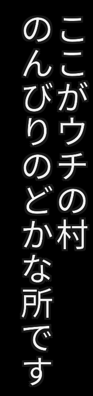
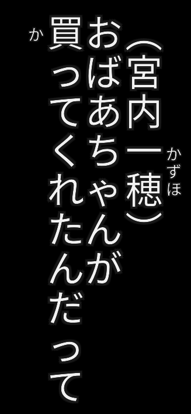

# 字幕エーディタ (Subtitle Editor)

An experimental work-in-progress subtitle editor with
**first class** Japanese language support.

Examples and rendering tests available at [jimaku-editor-examples](https://github.com/magiruuvelvet/jimaku-editor-examples)

## Planned Features

 - Furigana

 - Vertical writing (top to bottom)

 - Horizontal numbers in vertical text

 - Boutens

 - Rendering the finished subtitle to PGS (Presentation Graphic Stream) to
   overcome the limitations of text-based subtitles when it comes to the
   above features. (SRT/ASS/etc. don't support complex text layouts)

   There is already a working open source PGS encoder I'm planning to use
   for this project. I tested it and it works great and the PGS files are
   compatible with ffmpeg and ffmpeg-based media players :)

   --> [drouarb/PGSEncoder](https://github.com/drouarb/PGSEncoder)

 - Parse SRT files for Japanese subtitles (many of them can be found on the Internet)\
   Many existing subtitles can be made pretty and probably styled that way, without
   starting over from scratch.


## How does it work?

The first stage of the project is to get a command line renderer done.
The idea is to take the text, together with **styling and layout hints**,
as input and the application renders PNG images out of it, which can be
used to feed the PGS encoder to produce the final picture-based subtitle
which looks the same on every device and player.

The hard part will be the rendering of Furigana and vertical text.
For vertical text some font glyphs must be rotated 90 degree clockwise.
If you known Japanese than you know what I'm talking about.

For this I need to create a new subtitle format which can store several
styling and layout hints. To keep it simple I'm just extending the SRT
format with an additional line after the timestamp.

#### Example

```plain
2
00:00:16,599 --> 00:00:18,935 
# text-direction=horizontal
# text-alignment=center
# margin-overwrite=90
# font-size=42
（{宮内|みやうち}れんげ）おおーっ！
```

My idea is to have **global hints** on the top of the subtitle file which
applies for all lines and support overwriting hints for each line by
adding the hints below the timestamp.


## Styling and Layout Hints

*This list is a work in progress!!*

 - `text-direction`

   Possible values: `horizontal` (default), `vertical`

 - `text-alignment`

   The alignment of the text on the screen.

   Possible values for `horizontal`: `left`, `center` (default), `right`\
   Possible values for `vertical`: `right` (default), `left` (example image below is `right` aligned)

 - `text-justify`

   The text justification within the subtitle frame once rendered.

   Possible values for `horizontal`: `left`, `center` (default)\
   Possible values for `vertical`: `top` (default)

 - `margin-overwrite` **(overwrite only)**

   This property instructs the renderer how much margin from out-to-in
   must be applied for the subtitle frame.

   When the direction is horizontal this adjusts the bottom margin.\
   When the direction is vertical this adjusts the side margin (left/right),
   depending on the text alignment.

 - `margin-bottom`

   Default bottom margin. Default is 100 (*may change once the implementation has started*).

 - `margin-side`

   Default side margin. Default is 100 (*may change once the implementation has started*).

 - `margin-top`

   For vertical text only. Default top margin.
   Default is 150 (*may change once the implementation has started*).

 - `font-family`

   The font family the renderer should use to produce PNG images.

   The default font is `TakaoPGothic`.

 - `font-size`

   The size of the font in `pt`. Default is 48.

 - `font-color`

   The color of the font in HTML format with leading `#`.\
   Default is `#f1f1f1`.

 - `horizontal-numbers`

   This property only applies when `vertical` text direction is used.
   This instructs the renderer to place numbers horizontally on the
   same line instead of placing them from top to bottom.

   Possible values: `true` (default), `false`

 - `furigana-spacing`

   The spacing between each Kana. Defaults to the font glyph spacing.
   The value for the font default is `font`. Otherwise a number in pixel.

 - `furigana-distance`

   The distance between the Kanji and Furigana. This option is interesting together with
   the `line-space-reduction` option to adjust the Furigana distance on bad fonts.
   By default the distance is calculated to be directly placed to the Kanji, which works
   for most fonts. For fonts with huge glyph heights 3 possible values are offered to place
   the Furigana closer to the Kanji.

   Possible values: `none`, `narrow`, `far`, `unchanged` (default, use font defaults)

 - `furigana-font-size`

   The size of the font in `pt` for Furigana. Default is 20.

 - `furigana-font-color`

   The color of the Furigana font in HTML format with leading `#`.\
   Default is `#f1f1f1`.

 - `line-space-reduction`, `furigana-line-space-reduction`

   A value in pixel how much the spacing between lines in multi-line
   subtitle frames should be reduced. This may depend on the chosen
   font for the subtitle. Some fonts may have too much glyph height,
   which causes a huge amount on line spacing being rendered between lines.

   A seperate option for Furigana exists too.

   The default value is 0.

 - `border-color`

   The color of the text border in HTML format with leading `#`.\
   Default is `#191919`.

 - `border-size`

   The border size in pixel for the main text.\
   Default is 4.

 - `furigana-border-size`

   The border size in pixel for the Furigana.\
   Default is 2.


## Furigana

To instruct the renderer about Furigana I'm using the following format:

`{宮内|みやうち}れんげ`

The original text and Furigana are placed inside `{}`. The `|` (pipe) symbol
acts as separator. That way no complicated implementation must be done and
using of a library like ICU is not required. This makes is also possible for
subtitle writers to exactly place the Furigana were it belongs too.

This syntax is also already known to avoid confusing people.

The decision where the Furigana should be placed is automatic. The rules
are as follows:

 - horizontal first/top line == above Kanji
 - horizontal second/bottom line == below Kanji
 - vertical first/right line == right-side of Kanji
 - vertical second/left line == left-side of Kanji

Furigana are always "center" aligned for the first version of this project.
In the future I may add extra alignment hints for Furigana.

**Attention**: Furigana between lines which is not the first or the last line
are silently removed from the rendering result. If you are a subtitle writer,
take that in mind. In general, subtitles should not have more than 2 lines,
except when the first line is only the speaker name. The **hard limit** is 3 lines.
While the renderer just takes it, the rendering result may be undefined for more
than 3 lines.


## Why?

Because I want proper Japanese subtitles like they are shown on Netflix
or how they are found on Japanese Blu-Ray discs. Since the open source
community seems not to be very interested in supporting anything other
than European/American languages for subtitles, I decided to give it a
try myself. This editor might work for Chinese in the future too.

Recommended article for interested people:
[Implementing Japanese subtitles on Netflix](https://medium.com/netflix-techblog/implementing-japanese-subtitles-on-netflix-c165fbe61989)

### Example PGS subtitle in MPV

Example showing vertical writing with Furigana on the right side.


[Download](.readme/example.sup) and try yourself.


## Progress Report

#### 2020-01-04

Horizontal text rendering is finished.

Input: `（宮内{一穂|かずほ}）\nおばあちゃんが\n{買|か}ってくれたんだって`

Renders into this with the default values:


Input: `力を{集|あつ}め {新世界|しんせかい}への\nポータルを{開|ひら}く` (taken from Netflix Tech Blog)

Renders into this (left alignment):


Input: `{話|・}{せ|・}{る|・}` (Boutens)

Renders into this:


#### 2020-01-04 (late night)

Initial work on vertical text rendering has started.

Input: `ここがウチの村\nのんびりのどかな所です`

Renders into this:




#### 2020-01-05

Vertical furigana implement and general vertical rendering improvements.

Input: `（宮内{一穂|かずほ}）\nおばあちゃんが\n{買|か}ってくれたんだって`

Renders into this:




#### 2020-01-05 (early night)

Rendered the first subtitle today :)

Grep some examples at [jimaku-editor-examples](https://github.com/magiruuvelvet/jimaku-editor-examples)

